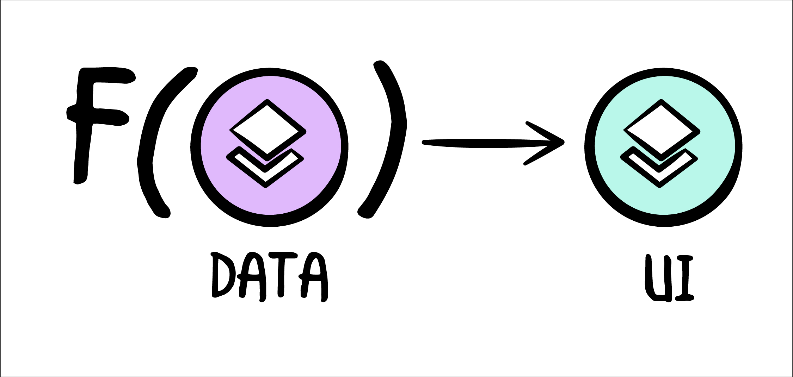

# MVVM

## Overview


The need for this architecture comes from technical and legal limitations one might have regarding importing 3rd party libraries, such as [The Composable Architecture](https://github.com/pointfreeco/swift-composable-architecture).

This architecture is guidelines only. It's really just a set of rules that you follow for yourself. There's no library, there's no compile/type enforcement.

There is a template I have created for this (more on that later), but that is it.

## Goals

This architecture is heavily inspired by TCA and this image:



1. UI as a function of state, often represented as `f(state) -> UI`
    - The UI should always be rendered from a piece of state
    - The UI should not be the source of state
    - It is particularly beneficial to prevent a disconnect between the UI and the state
1. Unidirectional data flow
    - It helps prevent data races
    - It prevents state mutations by the UI
    - It ensures consistency in how the state is mutated
1. Creating the application hierarchy from view models; not UI
    - It allows for fully testing UX flows in unit tests without a need for UI tests
    - It allows for recreating the app hierarchy from state without having to programmatically navigate through the UI
1. Introducing a consistent, functional and testable responder chain
    - Enables testability by making the test case the responder of the view model
    - It conveys intent that an action exists to go up the responder chain
    - It ensures consistency across all UI scenes

## The Responder

A single, very simple, new type is needed to create the responder chain:

```swift
struct Responder<Action> {
    var send: (Action) -> Void
}

extension Responder {
    // used for previews and testing
    static var noop: Self { .init { _ in } }
}
```

This responder type will be used in view models to bubble actions up the hierarchy chain. More context is provided in the [View Model Anatomy](#view-model-anatomy) section.

## The Rules


1. Each view representing a full scren _**must**_ have a 1:1 relationship with its view model, and _**only**_ its view model

    <details><summary>💔 No Good</summary>

    ```swift
    struct MyView: View {

        @StateObject var viewModel = ViewModel()
        @ObservedObject var otherViewModel = OtherViewModel()
        @ObservedObject var someProvider = SomeProvider()

        var body: some View {
            ...
        }
    }
    ```
    </details>
    <details><summary>💚 Good</summary>

    ```swift
    struct MyView: View {

        @StateObject var viewModel = ViewModel()

        var body: some View {
            ...
        }
    }
    ```
    </details>

1. The view can _**only**_ send actions with optional associated data to the view model

    <details><summary>💔 No Good</summary>

    ```swift
    struct MyView: View {

        @StateObject var viewModel = ViewModel()

        var body: some View {
            VStack {
                Button("Do This") {
                    viewModel.doSomethingLikeThis()
                }
                Button("Do That") {
                    viewModel.doSomethingLikeThat()
                }
            }
        }
    }
    ```
    </details>
    <details><summary>💚 Good</summary>

    ```swift
    struct MyView: View {

        @StateObject var viewModel = ViewModel()

        var body: some View {
            VStack {
                Button("Do This") {
                    viewModel.send(.doThis)
                }
                Button("Do That") {
                    viewModel.send(.doThat)
                }
            }
        }
    }
    ```
    </details>

1. Each view model action can _**only**_ handle at most a single state change; actions can recurse into other actions (e.g. actions can call the reducer with the next action)

    <details><summary>💔 No Good</summary>

    ```swift
    class ViewModel: ObservableObject {

        enum Action {
            case doThis
            case doThat
        }

        func send(_ action: Action) {
            switch action {
            case .doThis, .doThat:
                // handle both
                updateThisAndThat()
            }

            // OR

            switch action {
            case .doThis:
                updateThis()
                updateError()

            case .doThat:
                updateThat()
                updateError()
            }
        }
    }
    ```
    </details>
    <details><summary>💚 Good</summary>

    ```swift
    @MainActor
    class ViewModel: ObservableObject {

        enum Action {
            case doThis
            case doThat
            case error
        }

        func send(_ action: Action) {
            switch action {
            case .doThis:
                updateThis()
                send(.error)

            case .doThat:
                updateThat()
                send(.error)

            case .error:
                // handle error
            }
        }
    }
    ```
    </details>

1. All data (e.g. list items, formatted strings, etc...) and view states (e.g. loading, in progress, errors, etc...) the view needs to function _**must**_ be obtained from the view model's output.

    <details><summary>💔 No Good</summary>

    ```swift
    struct MyView: View {

        @State var items: [Int] = []

        var body: some View {
            VStack {
                ForEach(items) { item in
                    Text("\(item)")
                }
                Button("add") {
                    items.append(0)
                }
            }
        }
    }
    ```
    </details>
    <details><summary>💚 Good</summary>

    ```swift
    struct MyView: View {

        @StateObject var viewModel = ViewModel()

        var body: some View {
            VStack {
                ForEach(viewModel.items) { item in
                    Text("\(item)")
                }
                Button("add") {
                    viewModel.send(.append(0))
                }
            }
        }
    }
    ```
    </details>

1. The view's local state variables can _only_ be used to capture associated data for actions.

    <details><summary>💔 No Good</summary>

    ```swift
    class ViewModel: ObservableObject {

        enum Action {
            case authenticate(_ username: String, _ password: String)
        }

        func send(_ action: Action) {
            switch action {
            case .authenticate(let username, let password):
                // make network call, etc..
                print("username: \(username), password: \(password)")
            }
        }
    }

    struct MyView: View {

        @StateObject var viewModel = ViewModel()

        @AppStorage("username") var username = ""
        @AppStorage("password") var password = ""

        var body: some View {
            VStack {
                TextField("username", text: $username)
                TextField("password", text: $password)

                Button("Log in") {
                    viewModel.send(.authenticate(username, password))
                }
            }
        }
    }
    ```

    - The use of `UserDefaults` is implied by `AppStorage`
    - Every time the text field's value is modified by the user, it is sync'd back to user defaults without view model interaction
    - Missing view model interaction means this is untestable
    </details>
    <details><summary>💙 Ok</summary>

    ```swift
    @MainActor
    class ViewModel: ObservableObject {

        // MARK: - Input

        enum Action {
            case authenticate
            case updateUsername(String)
            case updatePassword(String)
        }

        func send(_ action: Action) {
            switch action {
            case .authenticate:
                // make network call, etc..
                print("username: \(username), password: \(password)")

            case .updatePassword(let password):
                self.password = password

            case .updateUsername(let username):
                self.username = username
            }
        }

        // MARK: - Output

        @Published private(set) var password = ""
        @Published private(set) var username = ""
    }

    struct MyView: View {

        @StateObject var viewModel = ViewModel()

        var body: some View {
            VStack {
                TextField("username", text: .init(
                    get: {
                        viewModel.username
                    },
                    set: { username in
                        viewModel.send(.updateUsername(username))
                    }
                ))

                TextField("password", text: .init(
                    get: {
                        viewModel.password
                    },
                    set: { username in
                        viewModel.send(.updatePassword(username))
                    }
                ))

                Button("Log in") {
                    viewModel.send(.authenticate)
                }
            }
        }
    }
    ```
    - All state is held into the view model
    - TextField requires the use of binding
    - The syntax for inline bindings is clunky
    - Published view model output must remain private(set) to prevent the UI from mutating state
    </details>
    <details><summary>💚 Good</summary>

    ```swift
    @MainActor
    class ViewModel: ObservableObject {

        enum Action {
            case authenticate(_ username: String, _ password: String)
        }

        func send(_ action: Action) {
            switch action {
            case .authenticate(let username, let password):
                // make network call, etc..
                print("username: \(username), password: \(password)")
            }
        }
    }

    struct MyView: View {

        @StateObject var viewModel = ViewModel()

        @State private var username = ""
        @State private var password = ""

        var body: some View {
            VStack {
                TextField("username", text: $username)
                TextField("password", text: $password)

                Button("Log in") {
                    viewModel.send(.authenticate(username, password))
                }
            }
        }
    }
    ```
    - Good use of state variable
    - State variables aren't used/leaked outside of this view
    - State variables act as a simple binding mechanism for TextField
    - State mutations are impossible without view model interaction
    </details>

1. The view can create the next view for navigation/state changes, but _**must**_ get that view's view model from its own view model.

    <details><summary>💔 No Good</summary>

    ```swift
    struct MyView: View {

        @StateObject var viewModel = ViewModel()

        var body: some View {
            ChildView(viewModel: ChildViewModel())
        }
    }
    ```
    </details>
    <details><summary>💚 Good</summary>

    ```swift
    struct MyView: View {

        @StateObject var viewModel = ViewModel()

        var body: some View {
            ChildView(viewModel: viewModel.childViewModel)

            // OR

            switch viewModel.state {
            case .childOne(let viewModel):
                ChildOneView(viewModel: viewModel)

            case .childTwo(let viewModel):
                ChildTwoView(viewModel: viewModel)
            }
        }
    }
    ```
    </details>

1. View models _**must**_ use the responder pattern for handling actions that aren't handled by their children view models.

    <details><summary>💔 No Good</summary>

    ```swift
    class ViewModel: ObservableObject {
        let action1: () -> Void
        let action2: () -> Void

        init(action1: () -> Void, action2: () -> Void) {
            self.action1 = action1
            self.action2 = action2
        }
    }

    struct MyView: View {

        @StateObject var viewModelL: ViewModel

        var body: some View {
            VStack {
                Button("first") { viewModel.action1() }
                Button("second") { viewModel.action2() }
            }
        }
    }

    struct ParentView: View {
        var body: some View {
            let viewModel = ViewModel(
                action1: {
                    // handler
                },
                action2: {
                    // handler
                }
            )

            MyView(viewModel: viewModel)
        }
    }
    ```
    </details>
    <details><summary>💚 Good</summary>

    ```swift
    @MainActor
    class ViewModel: ObservableObject {

        init(responder: Responder<ResponderAction>) {
            self.responder = responder
        }

        // MARK: - Responder

        enum ResponderAction {
            case action1
            case action2
        }

        private let responder: Responder<ResponderAction>

        // MARK: - Input

        enum Action {
            case action1
            case action2
        }

        func send(_ action: Action) {
            switch action {
            case .action1:
                responder.send(.action1)

            case .action2:
                responder.send(.action)
            }
        }
    }

    struct MyView: View {

        @StateObject var viewModel = ViewModel()

        var body: some View {
            VStack {
                Button("first") { viewModel.send(.action1) }
                Button("second") { viewModel.send(.action2) }
            }
        }
    }

    struct ParentView: View {
        var body: some View {
            let viewModel = ViewModel(
                responder: { action in
                    switch action {
                    case .action1: break
                    case .action2: break
                    }
                }
            )

            MyView(viewModel: viewModel)
        }
    }
    ```
    </details>

1. All view model dependencies **must** be passed into its constructor; the only exception are the ones obtained from the SwiftUI environment which must be passed to the view model through actions.

    <details><summary>💔 No Good</summary>

    ```swift
    class ViewModel: ObservableObject {

        // MARK: - Input

        enum Action {
            case save(String)
        }

        func send(_ action: Action) {
            switch action {
            case .save(let string):
                UserDefault.standard...
                NotificationCenter.shared...
                SomeProvider.shared...
            }
        }
    }
    ```
    </details>
    <details><summary>💚 Good</summary>

    ```swift
    @MainActor
    class ViewModel: ObservableObject {

        // MARK: - Dependencies
        private let userDefault: UserDefaults
        private let notificationCenter: NotificationCenter
        private let someProvider: SomeProvider

        init(userDefaults: UserDefaults, notificationCenter: NotificationCenter, someProvider: SomeProvider) {
            self.userDefaults = userDefaults
            self.notificationCenter = notificationCenter
            self.someProvider = someProvider
        }

        // MARK: - Input

        enum Action {
            case save(String)
        }

        func send(_ action: Action) {
            switch action {
            case .save(let string):
                userDefaults...
                notificationCenter...
                someProvider...
            }
        }
    }

    // OR

    @MainActor
    class ViewModel: ObservableObject {

        // MARK: - Dependencies
        private let userDefault: UserDefaults!
        private let notificationCenter: NotificationCenter!
        private let someProvider: SomeProvider!

        // MARK: - Input

        enum Action {
            case onAppear(UserDefaults, NotificationCenter, SomeProvider)
            case save(String)
        }

        func send(_ action: Action) {
            switch action {
            case .onAppear(let defaults, let center, let provider):
                self.userDefaults = defaults
                self.notificationCenter = center
                self.someProvider = provider
            case .save(let string):
                userDefaults...
                notificationCenter...
                someProvider...
            }
        }
    }

    struct MyView: View {

        @EnvironmentObject private var userDefaults: UserDefaults
        @EnvironmentObject private var notificationCenter: NotificationCenter
        @EnvironmentObject private var someProvider: SomeProvider

        @StateObject var viewModel = ViewModel()

        var body: some View {
            Text("Hello")
                .onAppear {
                    viewModel.send(.onAppear(userDefaults, notificationCenter, someProvider))
                }
        }
    }
    ```
    </details>

1. Every view model action _**must**_ be tested; every view model responder action _**must**_ be tested.

    <details><summary>💚 Good</summary>

    ```swift
    @MainActor
    class ViewModel {

        // MARK: - Lifecycle

        init(responder: Responder<ResponderAction>) {
            self.responder = responder
        }

        // MARK: - Responder

        enum ResponderAction {
            case success
        }

        private let responder: Responder<ResponderAction>

        // MARK: - Input

        enum Action {
            case foo
            case bar
            case qux
        }

        func send(_ action: Action) {
            switch action {
            case .foo:
                foo.toggle()

            case .bar:
                bar.toggle()

            case .qux:
                responder.send(.success))
        }

        // MARK: - Output

        @Published private(set) var foo = false
        @Published private(set) var bar = true
    }

    class ViewModelTest: XCTestCase {

        func testViewModel_initialState() {
            let sut = ViewModel(responder: .noop)

            XCTAssertFalse(sut.foo)
            XCTAssertTrue(sut.bar)
        }

        func testViewModel_whenSendingFooAction_togglesFooOutput() {
            let sut = ViewModel(responder: .noop)

            sut.send(.foo)

            XCTAssertTrue(sut.foo)
        }

        func testViewModel_whenSendingBarAction_togglesBarOutput() {
            let sut = ViewModel(responder: .noop)

            sut.send(.bar)

            XCTAssertFalse(sut.bar)
        }

        func testViewModel_whenSendingQuxAction_respondsWithSuccessOnlyOnce() {
            var output = 0
            let sut = ViewModel(
                responder: .init { action in
                    switch action {
                    case .success:
                        output += 1
                }
            )

            sut.send(.qux)

            XCTAssertEqual(output, 1)
        }
    }
    ```
    </details>

## View Model Anatomy

The view model contains up to 6 sections, in this order:

1. (optional) its private properties and dependencies
1. its lifecycle methods (e.g. init/deinit)
1. (optional) its responder actions and responder property
1. (optional) its input actions and reducer (e.g. the send method)
1. (optional) its output properties
1. (optional) private, supporting methods

Even though most of these sections are marked as optional, it's important to note that the vast majority of view models will contain most of these sections.

Types should be declared above properties and functions using them.

The view model should always be annotated with `@MainActor` since all output updates must be done on the main thread. It is your responsibility to dispatch hard work on a different thread.

A visual representation of the view model anatomy:

```swift
import Foundation
import SwiftUI

@MainActor
class ViewModel: ObservableObject {

    // MARK: - Properties & Dependencies

    private let useCase: SomeUseCase

    // MARK: - Lifecycle

    init(useCase: SomeUseCase, responder: Responder<ResponderAction>) {
        self.useCase = useCase
        self.responder = responder
    }

    deinit { } // only when needed

    // MARK: - Responder

    enum ResponderAction {
        case success
    }

    private let responder: Responder<ResponderAction>

    // MARK: - Input

    enum Action {
        case authenticate(String, String)
        case error(Error)
    }

    func send(_ action: Action) {
        switch action {
        case .authenticate(let username, let password):
            Task {
                let result = try await useCase.authenticate(
                    username: username,
                    password: password
                )

                switch result {
                case .success:
                    self.responder.send(.success)

                case .failure(let error):
                    self.send(.error(error))
                }
            }

        case .error(let error):
            animate(error: error)
        }
    }

    // MARK: - Output

    enum State { case idle }
    @Published private(set) var state: State = .idle
    @Published private(set) var error: Error?

    // MARK: - Support

    private func animate(error: Error?) {
        withAnimation { self.error = error }
    }
    private func animate(state: State) {
        withAnimation { self.state = state }
    }
}
```

## View Anatomy

The view contains up to 5 sections, in this order:

1. (optional) environment values and objects
1. (optional) local state variables (used for UI only)
1. view model
1. view body
1. (optional) supporting view builders

A visual representation of the view anatomy:

```swift
import SwiftUI

class SomeView: View {

    // MARK: - Environment

    @Environment(\horizontalSizeClass) var horizontalSizeClass

    // MARK: - Local State

    @State private var username = ""
    @State private var password = ""

    // MARK: - View Model

    @StateObject var viewModel: ViewModel

    // MARK: - Body

    var body: some View {
        VStack {
            title

            TextField("username", text: $username)
            TextField("password", text: $password)

            if let error = viewModel.error {
                Text("error: \(error)")
            }

            Button("Send") {
                viewModel.send(.authenticate(username, password))
            }
        }
    }

    // MARK: - Support

    @ViewBuilder
    private var title: some View {
        HStack {
            Text("hello, world")
            Image(systemName: "swift")
        }
    }
}
```

## Xcode Template

In order to facilitate this process, I've created an [Xcode file template](https://github.com/bsrz/xcode). The template will create the view, the view model (both with predefined sections) and links both together.

Follow the instructions in that repo to install the template.
